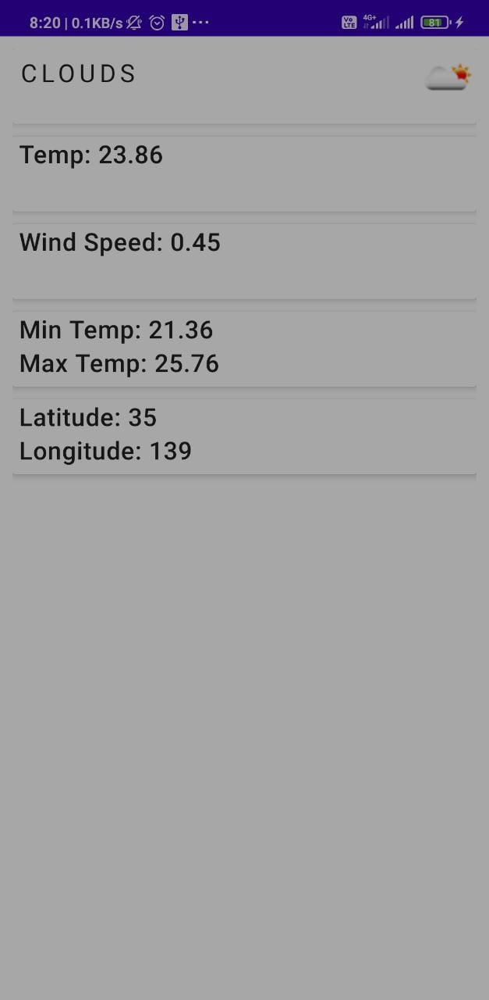

# WeatherApp

Weather App that fetches data from an API. I have used retrofit for Network Calls, Used GSON for conversion of JSON into POJO. Also used Glide for loading image from network.

## Table of Contents

* [Technologies Used](#technologies-used)
* [Features](#features)
* [Screenshots](#screenshots)
* [Setup](#setup)
* [Usage](#usage)
* [Room for Improvement](#room-for-improvement)
* [Contact](#contact)
<!-- * [License](#license) -->

## Technologies Used

- Retrofit
- GSON
- MDC
- Glide: for Image Loading

## Features

- Shows weather informations of a particular location

## Screenshots

## Setup

Just Clone the project & build on Android Studio

## Room for Improvement

Room for improvement:
- UI to be improvised
- Information for different location

To do:
- Share Weather Information with other apps
- Advanced Notification of Weather

## Contact

If you want to contact me you can reach me at <naskar.priyabrata66@gmail.com>.
